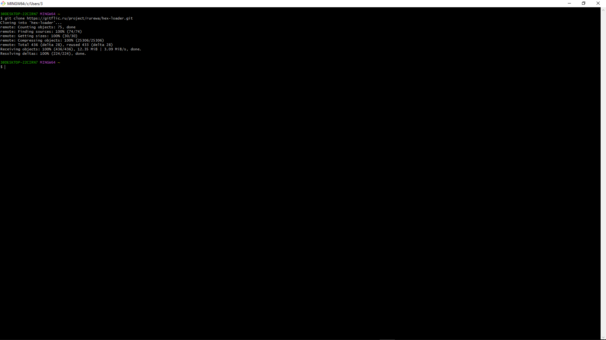
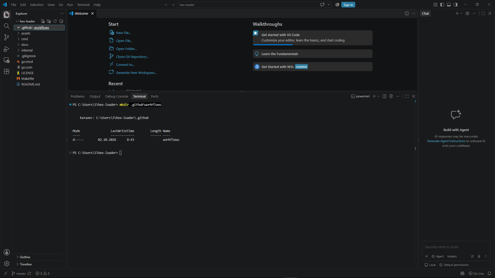
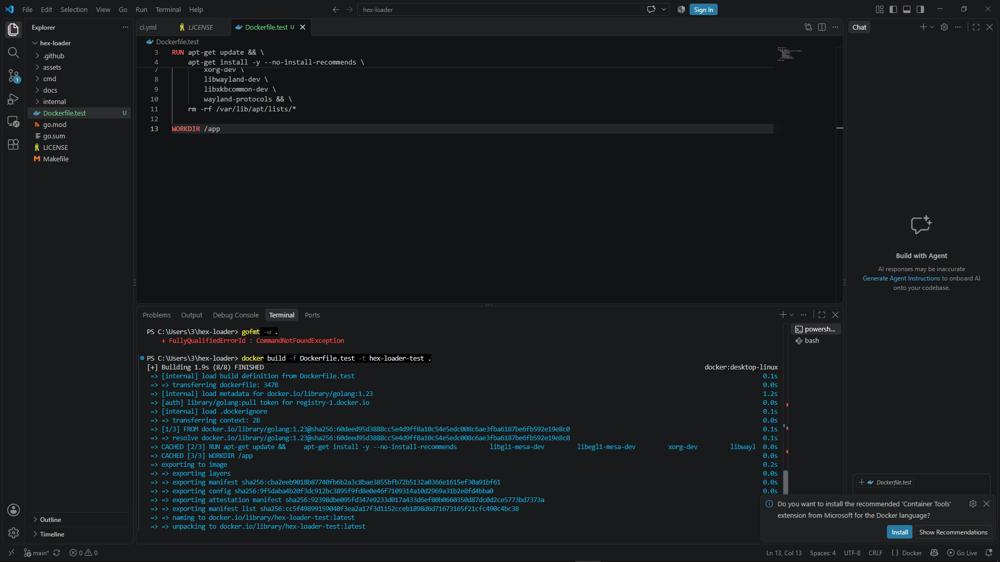
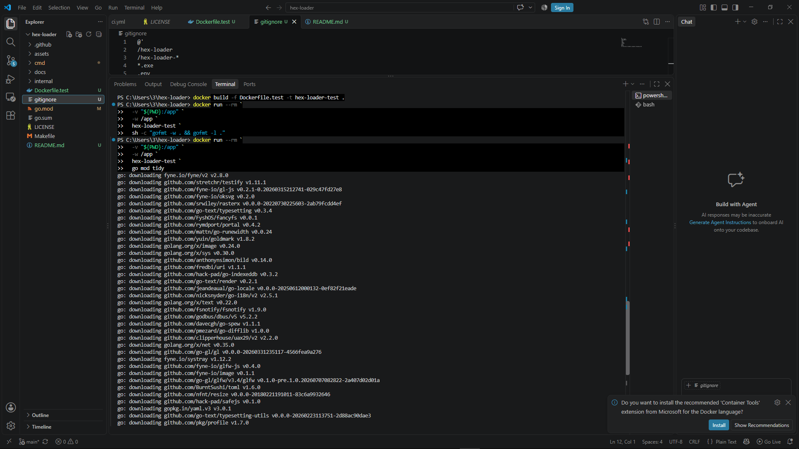
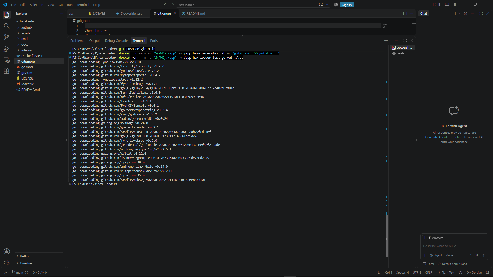
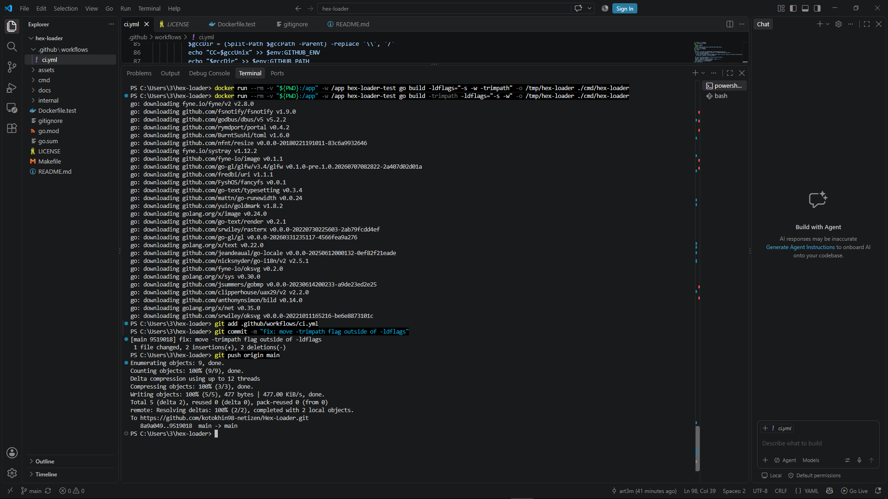
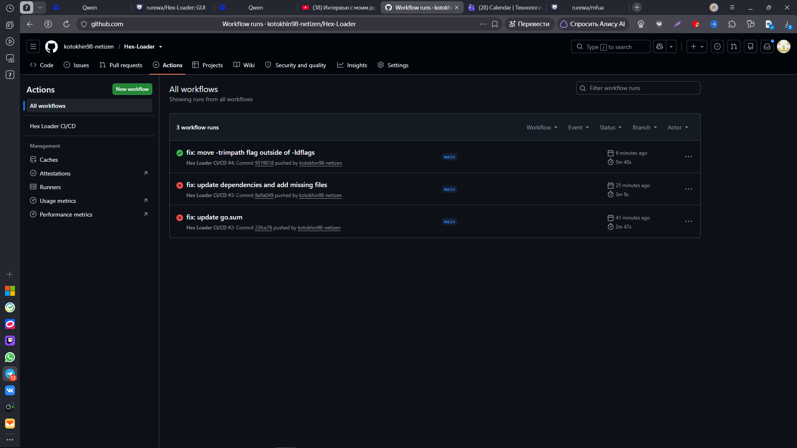
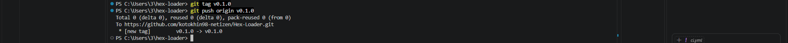
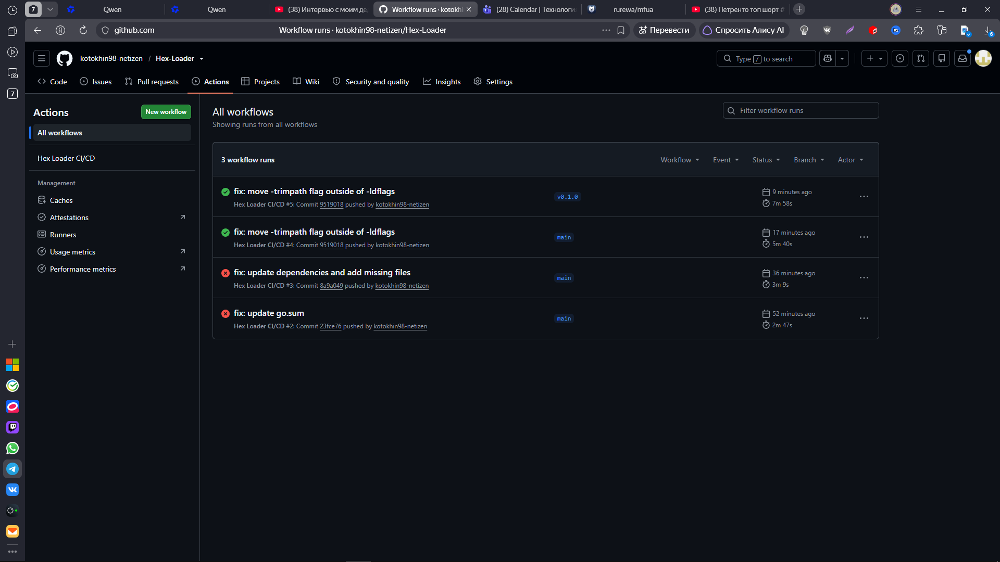
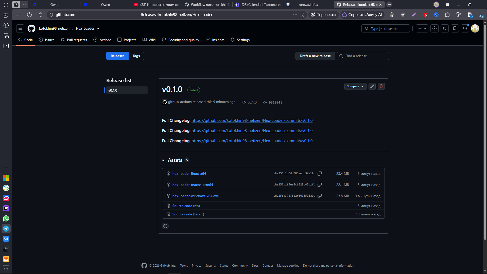

Отлично! 🎉 Теперь оформим красивый README.md с демонстрацией скриншотов.

Вот готовый файл в стиле предыдущих проектов:

```markdown
# Hex Loader CI/CD Pipeline

GUI-загрузчик HEX-файлов для Arduino на базе **Arduino CLI**, созданный на **Go** с использованием библиотеки **Fyne**. Демонстрирует настройку **пайплайна CI/CD** через GitHub Actions и публикацию кроссплатформенных **бинарников** в GitHub Releases.

##  О проекте

Hex Loader — это удобный графический интерфейс для прошивки плат Arduino:
- **Проверка прав пользователя Linux** — предупреждает о необходимости группы dialout (uucp)
- **Выбор HEX-файлов** через стандартный диалог
- **Сохранение последнего выбранного HEX-файла**
- **Обнаружение подключённых плат** (даже если они не распознаны arduino-cli)
- **Ручной выбор FQBN** для нераспознанных плат (из списка или вводом своего)
- **Загрузка прошивки** на плату с использованием arduino-cli
- **Работа без интернета** (используя локально установленные ядра и инструменты)

> ⚠️ **Важно:** В отличие от Go CLI, **GUI-приложения с CGO не поддерживают cross-compilation**. Для каждой ОС нужен **свой runner** с нативным компилятором.

## 📂 Структура проекта

```text
hex-loader/
── .github/workflows/
│   └── ci.yml              # Конфигурация CI (GitHub Actions)
├── Dockerfile.test         # Образ с GUI-зависимостями для Linux
├── cmd/
│   └── hex-loader/
│       └── main.go         # Точка входа (GUI на Fyne)
├── internal/               # Внутренние пакеты
── assets/                 # Иконки и ресурсы
├── docs/                   # Документация
├── go.mod                  # Go модуль
├── go.sum                  # Контрольные суммы зависимостей
├── Makefile                # Утилиты сборки
└── .gitignore
```

## 🛠 Локальный запуск

### Вариант 1: Локально (через Docker)
Не требует установки Go и GUI-библиотек на хост:

```bash
# Сборка тестового образа с GUI-зависимостями
docker build -f Dockerfile.test -t hex-loader-test .

# Запуск тестов
docker run --rm \
  -v "${PWD}:/app" \
  -w /app \
  hex-loader-test \
  go vet ./...

# Сборка бинарника (Linux)
docker run --rm \
  -e CGO_ENABLED=1 \
  -v "${PWD}:/app" \
  -w /app \
  hex-loader-test \
  go build -trimpath -ldflags='-s -w' -o hex-loader-linux-x64 ./cmd/hex-loader
```

**Ожидаемый результат:**
Бинарник `hex-loader-linux-x64` размером ~25-30 MB готов к запуску (требуется графическая среда).

### Вариант 2: Скачивание готового бинарника
Не требует установки Go или Docker. Просто скачайте файл из раздела [Releases](https://github.com/kotokhin98-netizen/Hex-Loader/releases).

**Windows (PowerShell):**
```powershell
Invoke-WebRequest -Uri "https://github.com/kotokhin98-netizen/Hex-Loader/releases/download/v0.1.0/hex-loader-windows-x64.exe" -OutFile "hex-loader.exe"
.\hex-loader.exe
```

**Linux / macOS:**
```bash
# Linux
curl -LO https://github.com/kotokhin98-netizen/Hex-Loader/releases/download/v0.1.0/hex-loader-linux-x64
chmod +x hex-loader-linux-x64
./hex-loader-linux-x64

# macOS
curl -LO https://github.com/kotokhin98-netizen/Hex-Loader/releases/download/v0.1.0/hex-loader-macos-arm64
chmod +x hex-loader-macos-arm64
./hex-loader-macos-arm64
```











## ⚙️ CI Pipeline (GitHub Actions)

При каждом push в ветку `main` или тег `v*` автоматически выполняется:

| Шаг | Инструмент | Назначение |
|-----|-----------|------------|
| Format check | `gofmt -l` | Проверка форматирования кода |
| Lint | `go vet` | Статический анализ |
| Build (smoke) | `go build -trimpath` | Проверка сборки |
| Matrix Build | CGO + GLFW | Сборка под 3 ОС параллельно |
| Release | `softprops/action-gh-release` | Публикация бинарников в Releases |

### Системные зависимости

**Linux (Ubuntu/Alt Linux):**
- `libgl1-mesa-dev` — OpenGL
- `libegl1-mesa-dev` — EGL
- `xorg-dev` — X11
- `libwayland-dev`, `wayland-protocols` — Wayland
- `libxkbcommon-dev` — раскладка клавиатуры
- `arduino-cli` — инструмент для работы с Arduino

**Windows:**
- **MSYS2** + MinGW-w64 GCC (устанавливается через `msys2/setup-msys2@v2`)
- Путь к `gcc.exe` определяется **динамически**, так как MSYS2 может устанавливаться в `$RUNNER_TEMP`

**macOS:**
- Xcode Command Line Tools (уже установлены на GitHub runners)

### Теги версий
- `v0.1.0`, `v0.2.0` — семантическое версионирование
- Версия внедряется через `-ldflags "-X main.version=${{ github.ref_name }}"`
- В коде переменная `version = "dev"` перезаписывается при сборке

## 📦 Публикация в GitHub Releases

Бинарники автоматически публикуются в **GitHub Releases** при push тега `v*`.

**URL релиза:**
```
https://github.com/kotokhin98-netizen/Hex-Loader/releases
```

**Доступные платформы:**
- `hex-loader-linux-x64` (~25-30 MB)
- `hex-loader-macos-arm64` (~25-30 MB)
- `hex-loader-windows-x64.exe` (~25-30 MB)

> 💡 Релиз создается **только** при push тега (например, `git tag v0.1.0 && git push origin v0.1.0`). Push в ветку `main` запускает только тесты.

## 🔧 Технологии

- **Go 1.23+** — язык программирования
- **Fyne v2** — кроссплатформенная GUI-библиотека
- **GLFW** — библиотека для создания окон (компилируется из C через CGO)
- **CGO** — интерфейс Go с C-кодом
- **Arduino CLI** — инструмент для работы с платами Arduino
- **GitHub Actions** — CI/CD pipeline с матричными сборками
- **GitHub Releases** — публикация бинарников
- **Docker** — локальная сборка с GUI-зависимостями
- **Semantic Versioning** — управление версиями через Git-теги

## 🐛 Troubleshooting

### Ошибка `fatal error: ... .h: No such file or directory`

**Решение:** Установите недостающие GUI-библиотеки (см. раздел "Системные зависимости").

### Ошибка `gcc.exe not found` на Windows

**Решение:** Убедитесь, что MSYS2 установлен и путь к `gcc.exe` добавлен в PATH. В CI путь определяется автоматически.

### Ошибка `missing go.sum entry`

**Решение:** Выполните `go mod tidy` и закоммитьте `go.sum` в репозиторий.

### Arduino CLI не может загрузить индексы в РФ

**Решение:**
1. Используйте системный VPN — самый надёжный способ
2. Скачайте и распакуйте вручную файлы индексов в папку `~/.arduino15`:
   - https://downloads.arduino.cc/packages/package_index.tar.bz2
   - https://downloads.arduino.cc/libraries/library_index.tar.bz2
3. Перенесите папку `~/.arduino15/packages/` с другого компьютера

### Сборка падает на macOS с `Connect Timeout Error`

**Решение:** Это транзиентная проблема GitHub API. Перезапустите failed job в Actions.

## 📝 Локальная разработка

### Требования для разработки без Docker

**Linux (Ubuntu/Debian/Alt Linux):**
```bash
sudo apt-get install \
  libgl1-mesa-dev \
  libegl1-mesa-dev \
  xorg-dev \
  libwayland-dev \
  libxkbcommon-dev \
  wayland-protocols \
  arduino-cli
```

**Windows:**
1. Установите [MSYS2](https://www.msys2.org/)
2. Запустите MSYS2 MinGW 64-bit
3. Установите компилятор: `pacman -S mingw-w64-x86_64-gcc`
4. Установите [Arduino CLI](https://arduino.github.io/arduino-cli/latest/installation/)

**macOS:**
```bash
xcode-select --install
brew install arduino-cli
```

### Сборка и запуск

```bash
# Установка зависимостей
go mod download

# Проверка кода
go vet ./...

# Сборка
go build -trimpath -ldflags="-s -w" -o hex-loader ./cmd/hex-loader

# Запуск
./hex-loader
```






---

**Автор:** [kotokhin98-netizen](https://github.com/kotokhin98-netizen)  
**Лицензия:** MIT  
**Оригинальный проект:** [rurewa/hex-loader](https://gitflic.ru/project/rurewa/hex-loader)
```

---

